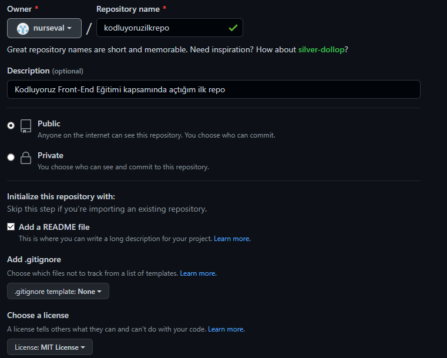

# Kodluyoruz Ilk Repo
[Bu Kodluyoruz](https://www.kodluyoruz.org) Front-End Eğitimi kapsamında açtığım ilk repo. İçerisinde Bir adet README dosyası. bir adet de index html barındırıyor.



# Installation

Öncelikle projeyi clonelayın.(Buraya sizin reponuzdan aldığınız link gelecek.)

```
git clone https://github.com/nurseval/kodluyoruzilkrepo.git

```
# Usage

Projeyi cloneladıktan sonra Visual Studio Code programında açınız.
Linux için:

```
cd kodluyoruzilkrepo
code .
```

# Contributing

Pull requestler kabul edilir. Büyük değişiklikler için, lütfen önce değiştirmek istediğinizi tartışmak için bir konu açınız.

# License

[MIT](https://www.mit.edu)

[Patika Dev Sayfam](https://app.patika.dev/sevaalnuur)